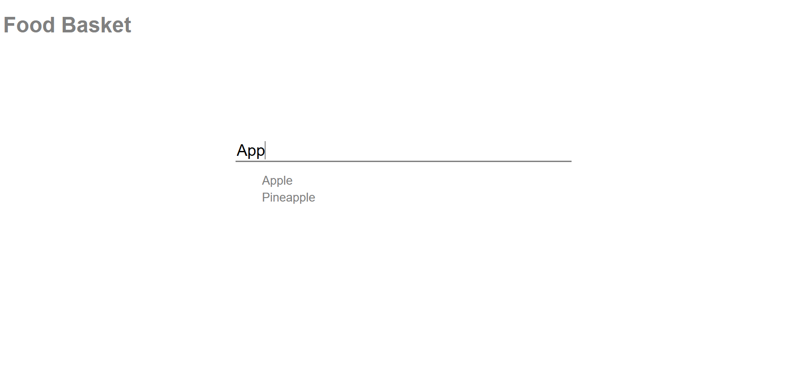
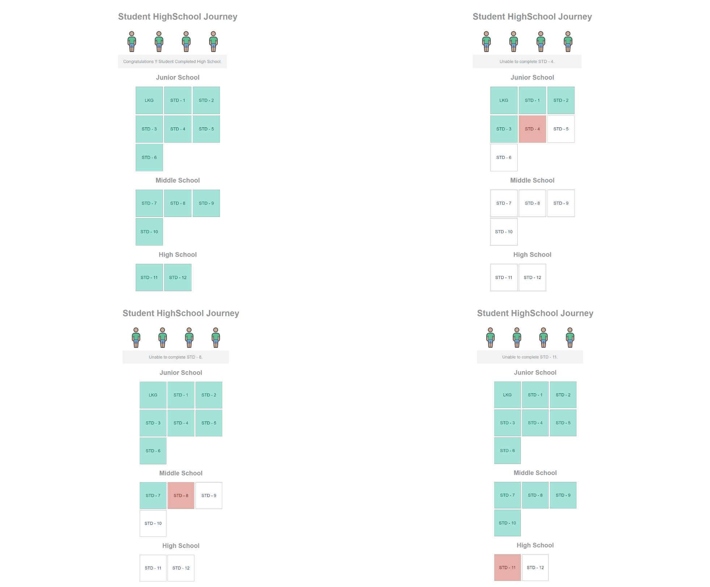

# JavaScript Machine Coding Round Examples
This repository contains a collection of JavaScript examples designed to help developers practice for machine coding rounds, commonly encountered in technical interviews. Each example simulates real-world coding problems that require candidates to implement functionality using clean, modular, and efficient code.

### Key Features:
- **Problem-Oriented :** The repository includes sample problem statements along with well-structured solutions in JavaScript.
- **Interactive Examples :** Each example demonstrates different problem-solving techniques and patterns such as event handling, DOM manipulation, data structures, API calls, and more.
- **Real-World Scenarios :** The problems mimic real-life use cases, such as building a dynamic UI component, implementing an autocomplete feature, creating a task manager, or building a simple calculator.
- **Best Practices :** The code follows clean coding principles, including modularity, proper use of ES6+ features, and scalability, to prepare developers for industry-standard practices.
- **Comprehensive Comments :** Every solution is well-documented with comments to explain the approach, making it easy for beginners and intermediates to follow along.
- **Test Cases :** Where applicable, test cases and edge cases are included to help ensure the solution is robust.

### Content
- **Food Basket :** The Food Basket app is a simple web application where users can search for food items using an input field. As the user types, suggestions matching their query are dynamically displayed below the input field in a suggestion list. The app is styled with an external CSS file and utilizes JavaScript to handle user input and update the suggestions in real-time. The layout includes a header with the app's title and a container for the search bar and suggestions.
  

- **Student High School Journey :** This is a mini project designed to demonstrate how promises work in JavaScript. In this scenario, we use 4 students to illustrate how they progress from junior school to high school. Just as in real life, a student cannot directly jump to middle or high school; they must follow a sequential path. Similarly, in a promise chain, each promise resolves one after another. If any promise fails, the remaining promises will not be executed, and the chain will break immediately.

